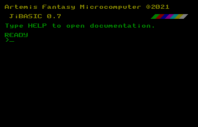

- **[The Main Interface](main)**
- **[Programming Reference](programming)**

# Artemis - A Fantasy Microcomputer



## What is a Fantasy Computer?

A Fantasy Computer is neither a recreation of a computer that never existed. Providing a platform to create software with the limitations of older machines. The idea is to be inspired and challenged by these constants.

## Why Artemis?

Artemis is supposed to be a challenging fantasy computer. Can you create a fun game with the following limitations?

- Using a fairly limited and slow Unstructured BASIC language. (Though improvements to the language may be incoming...)
- 7 text modes to choose from, each a different compromise between number of characters and colors on the screen
- 125 possible colors and 255 redefinable character glyphs
- No graphical modes at all

As mentioned above JiBASIC is slow. This isn't a bug, it's a feature (or to be more accurate not a priority.) Artemis is explicitly not designed to be friendly to developing real-time action games. Turn-based, menu-driven and text-heavy games would be ideal.

## Inspirations

This project was inspired by Basic8 and Ozapell Basic, nether of which was _quite_ what I was after.

Artemis' specifications (and name) were inspired by the Amstrad CPC line of machines. The CPC's unusual 3-level RGB palette was expanded to 5-level for Artemis. The character set is also inspired by Amstrad's custom extended ASCII, using most of the same glyph positions.

## Development

Artemis is also free open-source software and should work on many platforms.

Artemis is currently beta software. However, an important goal is to maintain forward compatibility for programs.

JiBASIC is a fork of [PyBasic](https://github.com/richpl/PyBasic) by richpl with many platform-dependent features added. Fixes and improvements from PyBasic will be pulled in to JiBASIC, and any fixes here will be sent back via pull-request. Much of the following documentation is also forked from PyBasic.

Currently most programs written for, or saved in, PyBasic will run in Artemis. But this may not be the case in the future.

Artemis is also powered by [pygame2](https://www.pygame.org/) and [midiutil](https://github.com/MarkCWirt/MIDIUtil)

## To start...

### Windows

Run `artemis.exe` under Windows. If you used the installer, an icon will be placed on your desktop.

### Other platforms

Install Python 3, then use pip to install the required libraries:
```
pip install pygame midiutil
```

Then to start...
```
python interpreter.py
```

pypresence for discord presence is an optional library. It will be used if present.

## Example programs

A number of example programs are provided, you can find them on the EXAMPLES disk. Type `MOUNT EXAMPLES` to switch to the disk and `LIST S` to show the programs. Load using example using `LOAD <name>`, view it's source-code with `LIST` and run it with `RUN`.

Example programs

* `CHARS` - Prints every available character symbol
* `CODERAIN` - 'Matrix' inspired falling characters visual. Demonstrates POKES
* `FACTORAL` - Calculates a factorial from user input
* `FONT` - Demonstrates replacing the entire symbol set using SYMBOLIMG
* `INK` - Demonstrates INK command and shows all possible 125 colors
* `INPUT` - Demonstrates INPUT command
* `KEYCODES` - Prints key-codes when keys are pushed
* `LOADS` - Loads a screen-dump file on to the screen using the LOADS command
* `MAZE` - Demonstrates RND and RNDINT by drawing a random maze
* `MODES` - Shows every available text mode and default palette
* `MUSIC` - Demonstrates MUSICPLAY and MUSICSTOP commands
* `PLOT` - Demonstrates pseudo-pixel plotting using PLOT command
* `PRINTW` - Demonstrates printing to a window using PRINTW command
* `REFRESH` - Demonstrates how to control screen drawing with REFRESH WAIT
* `RESETFONT` - Resets to the default character set. (Use after running `FONT`)
* `ROCKPAPERSCISSORS` - Rock, Paper, Scissors game versus the computer
* `SYMBOL` - Demonstrates changing a single text symbol using the SYMBOL command

Text files containing these examples can be found with the .bas extension in `document\artemis\EXAMPLES\`.

## The Maze

The Maze is a very simple puzzle game serving a proof-of-concept. If you type `MOUNT MAZE` the game will begin automatically.

You can use CTRL-C to exit the game, then use `LIST` to see the program source.
